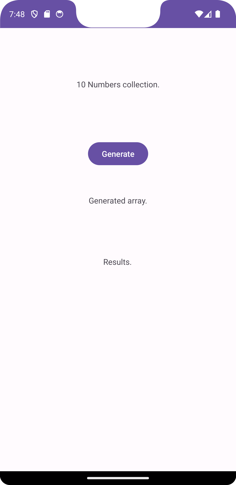
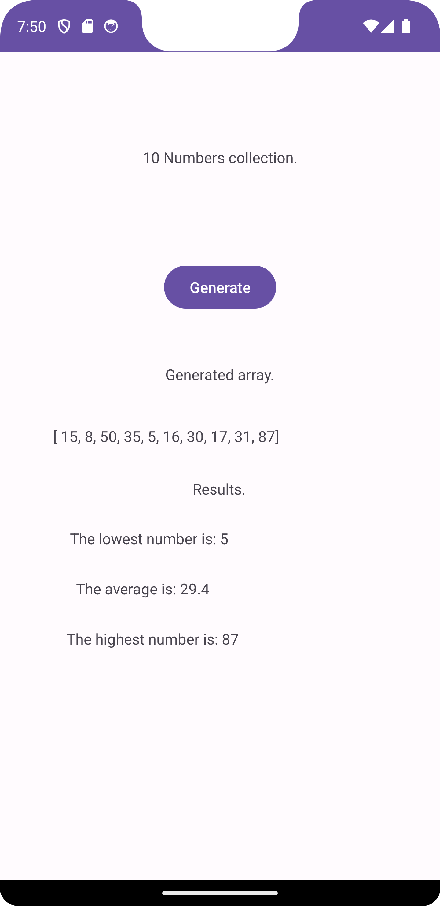

# Random Number Vector Generator

This Android application, developed in Kotlin using Android Studio, serves as a handy tool to generate random integer vectors and calculate statistical values on the fly. 

## Description

The app offers a straightforward and user-friendly interface where you can simply press a button to generate a vector of 10 random integers, each ranging between 1 and 100. Alongside the generated vector, the app promptly displays the minimum, maximum, and average values of the numbers contained within the vector.

## Features

- Easy-to-use interface with a single button for generating vectors.
- Generates random integer vectors with 10 elements.
- Computes and displays the minimum, maximum, and average values of the generated vector.
- Enjoy the efficiency and simplicity of Kotlin programming.

## Getting Started

1. Clone this repository to your local machine.
2. Open the project in Android Studio.
3. Build and run the application on your Android device or emulator.
4. Click the "Generate" button to create a random vector and view the statistical values.

## Screenshots

## Feedback

If you have any feedback, suggestions, or issues to report, please feel free to [create an issue](https://github.com/AlexCernas2901/kotlin-random-number-generator/issues).

## License

This project is licensed under the MIT License - see the [LICENSE](LICENSE) file for details.
